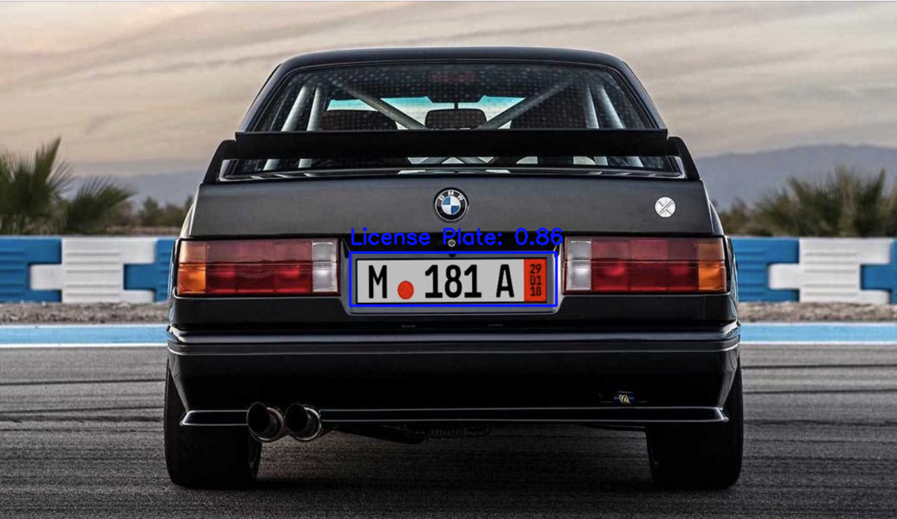

# 🚗 Vehicle Vision System

A production-ready **Computer Vision** system built with **YOLOv8** and **FastAPI**, offering real-time APIs for:

- 🔍 **License Plate Detection**
- 💥 **Vehicle Damage Detection**
- 🚘 **Vehicle Detection**

This project showcases end-to-end deep learning integration — from **training custom models** to **deploying scalable APIs**, making it a powerful example of applying computer vision to real-world automotive use cases.

---

## 🛠️ Tech Stack


---

> 💡 **Note:** Pretrained model weights and datasets are **not included** in this repo for intellectual property reasons. The README includes instructions on training and integrating your own models.


## 🚘 Project Overview

**Vehicle Vision System** is a complete computer vision pipeline built to detect, identify, and analyze vehicles in real-world images. This system includes three production-ready APIs powered by custom-trained YOLOv8 models:

- 📛 **License Plate Detection API** – Locates and extracts license plates from vehicle images.
- 🚗 **Vehicle Type Detection API** – Identifies and classifies vehicles (e.g., car, truck, bus).
- 💥 **Vehicle Damage Detection API** – Detects external damage areas like broken bumpers, hoods, or headlights.

Designed for real-time applications like insurance claim processing, parking automation, and vehicle registration systems, this project integrates modern deep learning models with a FastAPI backend for efficient, scalable deployment.

---

### 🔍 Key Features

- ✅ **Three separate endpoints** with modular model handling
- 🧠 **Custom-trained YOLOv8 models** for high-accuracy object detection
- 🖼️ **Base64 image support** for simple frontend integration
- 📦 **Clean codebase structure** ready for production or research extension
- 📊 **Extensible logging system** for tracking inference and failures
- 🧪 **Built-in test scripts** for quick local validation

This project simulates a real-world AI system with model training, optimization, and deployment — ideal for production teams or research applications.


## Examples / Demo

This section demonstrates sample inputs and the corresponding outputs for the three main APIs in the Vehicle Vision System: License Plate Detection, Vehicle Type Classification, and Vehicle Damage Detection.

---


### Vehicle Detection


**API Request (Python example):**

    import requests
    import base64

    with open("examples/vehicle_001.jpg", "rb") as img_file:
        b64_image = base64.b64encode(img_file.read()).decode()

    payload = {"image": b64_image, "origin": "demo"}

    response = requests.post("http://localhost:8000/api/v1/vehicle-detection", json=payload)
    print(response.json())

**Sample API Response:**

    {
      "detections": [
        {
          "label": "Vehicle",
          "confidence": 0.97,
          "box": [120, 80, 280, 140]
        }
      ]
    }

**Output Visualization:**


---


### License Plate Detection


**API Request (Python example):**

    import requests
    import base64

    with open("examples/license_plate_01.jpg", "rb") as img_file:
        b64_image = base64.b64encode(img_file.read()).decode()

    payload = {"image": b64_image, "origin": "demo"}

    response = requests.post("http://localhost:8000/api/v1/license-plate-detector", json=payload)
    print(response.json())

**Sample API Response:**

    {
      "detections": [
        {
          "label": "Vehicle Plate",
          "confidence": 0.97,
          "box": [120, 80, 280, 140]
        }
      ]
    }

**Output Visualization:**



---

### Vehicle Damage Detection


**API Request (Python example):**

    import requests
    import base64

    with open("examples/vehicle_damage_01.jpg", "rb") as img_file:
        b64_image = base64.b64encode(img_file.read()).decode()

    payload = {"image": b64_image, "origin": "demo"}

    response = requests.post("http://localhost:8000/api/v1/vehicle-damage-detector", json=payload)
    print(response.json())

**Sample API Response:**

    {
      "detections": [
        {
          "label": "damaged bumper",
          "confidence": 0.88,
          "box": [230, 340, 450, 470]
        },
        {
          "label": "damaged headlight",
          "confidence": 0.82,
          "box": [120, 200, 180, 260]
        }
      ]
    }

**Output Visualization:**


## Training the Models

This project leverages custom-trained YOLOv8 models for three key computer vision tasks:

- License Plate Detection
- Vehicle Type Classification
- Vehicle Damage Detection

To achieve high accuracy and robustness, the models were trained on carefully curated datasets with precise annotations.

### Dataset Preparation & Labeling

For training, images need to be collected and annotated according to the task:

- **License Plate Detection:** Annotate bounding boxes around vehicle license plates.
- **Vehicle Type Classification:** Label images by vehicle type (e.g., Sedan, SUV, Truck).
- **Vehicle Damage Detection:** Annotate damaged vehicle parts with bounding boxes (e.g., damaged bumper, broken headlight).

**Recommended Tool:** [Roboflow](https://roboflow.com/) is an excellent platform for dataset management, annotation, and export in YOLO format. You can upload images, label them with bounding boxes, and export datasets ready for YOLOv8 training.

### Example: Dataset Structure (YOLO format)

```
/dataset
/images
/train
img001.jpg
img002.jpg
...
/val
img101.jpg
img102.jpg
...
/labels
/train
img001.txt
img002.txt
...
/val
img101.txt
img102.txt
...
```
**Pro tip:**  
Use annotation tools such as [LabelImg](https://github.com/tzutalin/labelImg) or [Roboflow](https://roboflow.com/) to speed up the labeling process and export directly in YOLO format.

If you want to see a full training pipeline example, check out the [Ultralytics YOLOv8 docs](https://docs.ultralytics.com/).


Each `.txt` label file corresponds to an image and contains object annotations formatted as:  
`<class_id> <x_center> <y_center> <width> <height>`,  
where coordinates are normalized (values between 0 and 1) relative to the image dimensions.

### Training Workflow

The models were trained using the [Ultralytics YOLOv8](https://docs.ultralytics.com/) framework, which provides an efficient and flexible pipeline.

Basic steps include:

1. **Label your data:** Annotate images using the tools mentioned above.
2. **Organize dataset:** Structure images and labels following the example above, ensuring a split between training and validation sets.
3. **Train the model:** Use commands like the following to start training:

```bash
yolo task=detect mode=train model=yolov8n.pt data=dataset.yaml epochs=50 imgsz=640
```

---